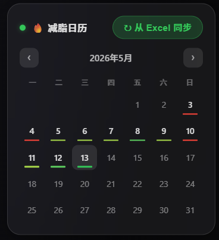
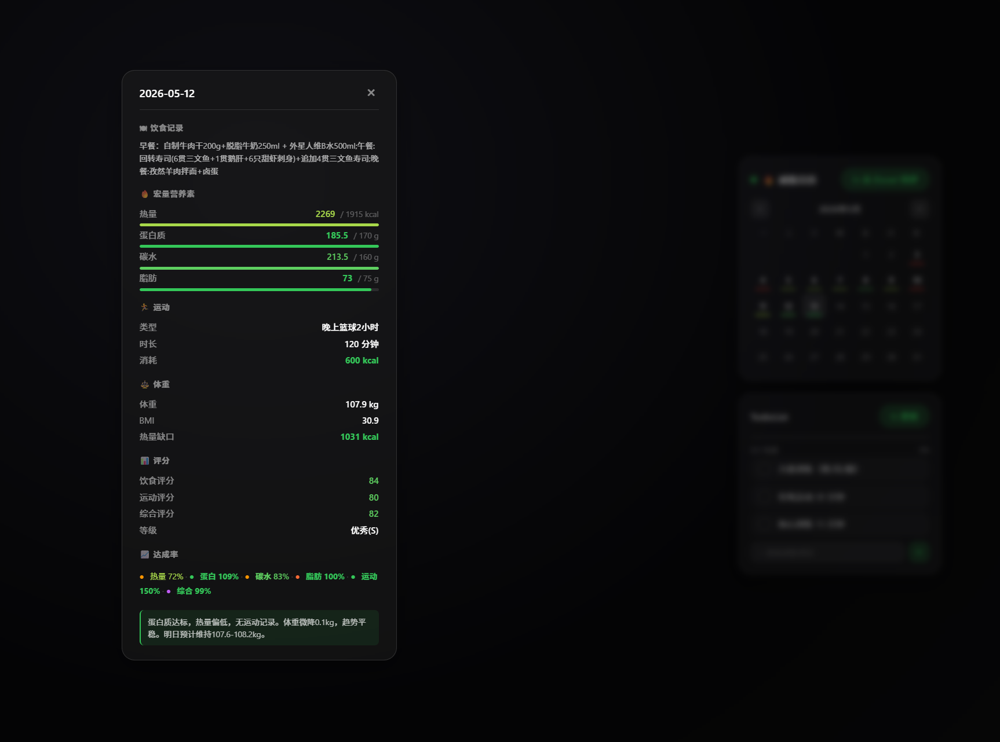

# Fitness Dashboard

> Desktop fitness tracking with real-time nutrition scoring, calendar heatmap, and training todo list.
> **Primary: Lively Wallpaper plugin. Secondary: standalone exe widget.**


## Screenshots

| Desktop (Wallpaper Mode) | Daily Detail Card |
|:---:|:---:|
|  |  |

## Features

- **Diet Calendar** — Monthly calendar heatmap with daily nutrition scores and macro breakdown
- **Scoring Engine** — 6-metric sports-nutrition scoring (Bell Curve with tolerance bands, asymmetric penalties)
- **Training TodoList** — Weekly plan synced from Word doc, parsed by indentation, auto-resets daily
- **Month Charts** — 5 scientific charts: energy balance, macros, weight/BMI, compliance rates, scores
- **Music Player** — Now-playing display with cover art and audio visualizer *(wallpaper mode only)*
- **Glass-morphism UI** — Frosted glass design with 5-level color coding, fully transparent background

## How It Works

```
FitnessDiary.xlsx (your diet)  ──→  diet_sync_server.py     :17532
ToDoList.docx    (your plan)   ──→  training_sync_server.py  :17533
                                            │
                       ┌────────────────────┤
                       ▼                    ▼
              Lively Wallpaper       Desktop Widget (backup)
           (full features)          (calendar + todo only)
```

## Quick Start

### Prerequisites
- Windows 10/11
- Python 3.10+
- [Lively Wallpaper](https://www.rocksdanister.com/lively/) (free, for wallpaper mode)

### Install
```bash
pip install openpyxl python-docx
```

### Wallpaper Mode (Recommended)

1. Copy `example-data/FitnessDiary.xlsx` and `example-data/ToDoList.docx` to your desktop
2. Start the backend servers:
   ```bash
   python server/start_server.pyw
   ```
3. Open Lively Wallpaper → drag `wallpaper/index.html` into it
4. Set as wallpaper

You get: calendar + todo + charts + music player + audio visualizer, all with perfect transparency.

### Widget Mode (Backup)

Standalone window when you don't need the full wallpaper experience:

```bash
pip install pywebview
python widget/widget.py
```

Or build a single exe: `cd widget && build.bat` → `dist/CalendarWidget.exe`

> **Note:** The standalone widget uses a frameless window and may show thin white borders on some Windows versions. This is a platform limitation. For the best visual experience, use wallpaper mode.

## Project Structure

```
├── wallpaper/          # ★ PRIMARY: Lively Wallpaper plugin
│   ├── index.html      # Main entry (full features)
│   ├── js/             # Calendar, charts, music, todo, core modules
│   └── data/           # Fallback data
├── server/             # Python backends (shared by both modes)
│   ├── diet_sync_server.py         # Excel parser + scoring engine
│   ├── training_sync_server.py     # Word parser + training API
│   ├── start_server.pyw            # Silent launcher
│   └── generate_todolist_docx.py   # JSON → Word generator
├── widget/             # Backup: standalone exe widget
│   ├── widget.py       # pywebview launcher
│   └── build.bat       # PyInstaller build script
├── docs/               # Full specification (Chinese)
└── example-data/       # Example files (fake data)
```

## Scoring System

Six achievement rates, each with scientifically-motivated directionality:

| Metric | Type | Tolerance | Rationale |
|--------|------|-----------|-----------|
| Calories | Bell Curve (symmetric) | ±10% | Under-eating = metabolic damage; over-eating = fat gain |
| Protein | Linear (one-way) | cap 150% | No harm at practical intake levels |
| Carbs | Bell Curve (mild) | ±20% | Performance fuel; overage caught by calorie total |
| Fat | Range-based | 70-130% | Hormone floor; excess = calorie density |
| Exercise | Linear (one-way) | cap 150% | More is better; overtraining caught by deficit metric |
| Deficit | Bell Curve | ±20% | Goldilocks zone; too much = muscle loss |

See `docs/` for the full specification including Excel column layout, AI fill-in guide, and exercise science methodology.

## Tech Stack

- **Frontend**: Vanilla JS, Canvas API, CSS backdrop-filter
- **Backend**: Python stdlib `http.server`, openpyxl, python-docx
- **Wallpaper**: Lively Wallpaper (Chromium embed)
- **Widget**: pywebview (Edge WebView2) — backup only
- **Packaging**: PyInstaller

## License

MIT — use it, fork it, learn from it. Built by a first-year CS student.
